## Website Pembelajaran Proton
Judul Proyek   : Website Pembelajaran Proton
Client         : Bp. Deni Harnova
Tim Pengerjaan :
1. Muhammad (14117162) / Project Manager
2. Rizqun Rizal Ahsani (14117133) / Development
3. Cikal Arvi Yuliawan (14117179) / UI/UX
4. Yustika Ayu Putri Zalukhu (14117040) / QA
5. Titis Prawilas Sari (14117065) / Documentation
6. Talitha Brilinia Batari (14117122) / Documentation

### Deskripsi Singkat
Website Pembelajaran Proton adalah sebuah website yang menyediakan informasi suatu bimbel bernama Proton secara lengkap, yang diharapkan dapat memudahkan pengajar dan siswa dalam penyampaian materi dan segala sesuatu yang berkaitan dengan pembelajaran. Website ini juga digunakan sebagai media untuk memperkenalkan bimbel Proton kepada khalayak umum.

### Tujuan Pembuatan Website Pembelajaran Proton
Adapun tujuan dari pembuatan website pembelajaran Proton ini adalah sebagai berikut :
1. Membantu memperkenalkan Bimbel Proton kepada masyarakat umum.
2. Mempermudah Pengajar dan Siswa dalam pemberian materi (baik tulisan maupun video) secara online.
3. Memudahkan pemberian informasi jadwal kepada Siswa.
4. Memberikan berita-berita terkini Bimbel Proton dalam bentuk artikel online.

### Bagian-Bagian Website
#### 1. Halaman Home

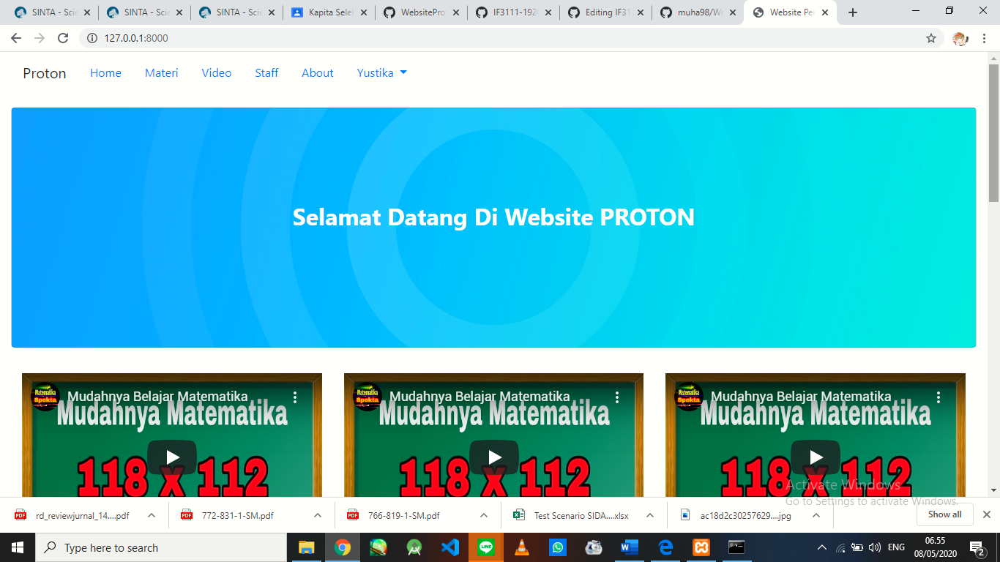

Halaman home adalah halaman yang muncul pertama kali ketika pengguna mengunjungi website. Halaman home memuat tulisan "Selamat datang di website Proton" yang dibuat dengan menggunakan jumbotron. Kemudian dibawahnya terdapat 3 buah video yang nantinya akan diisi dengan video pengenalan Bimbel Proton. Dibawah video terdapat 3 gambar yang dapat berganti dan dibawahnya lagi terdapat 3 buah artikel. Artikel-artikel ini nantinya akan memuat berita-berita ter-update Proton sehingga dapat diketahui dan dibaca oleh Siswa maupun pengguna umum.

#### 2. Halaman Materi

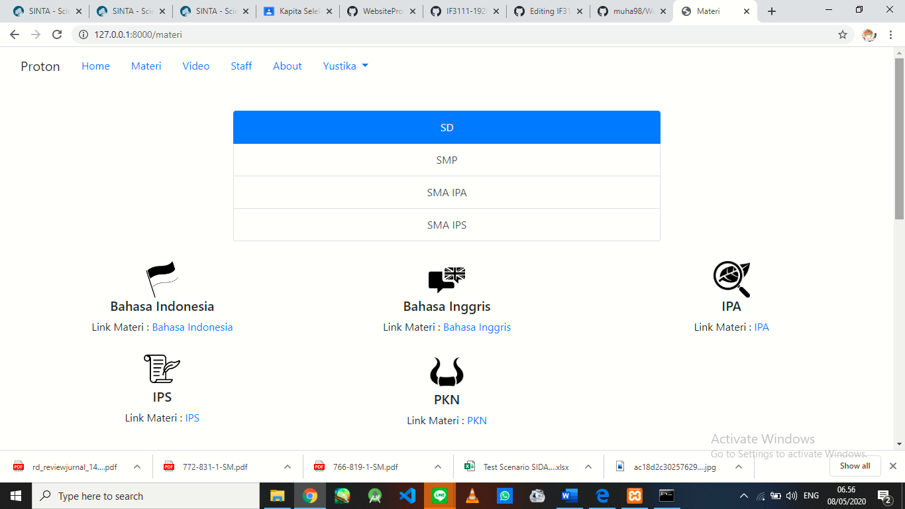

Halaman materi hanya dapat dibuka ketika pengguna telah melakukan login. Sehingga orang yang bukan pelajar tidak dapat membuka halaman ini karena tidak memiliki akun. Halaman materi berisikan berbagai macam kategori dan mata pelajaran yang terhubung ke google drive.

#### 3. Google Drive

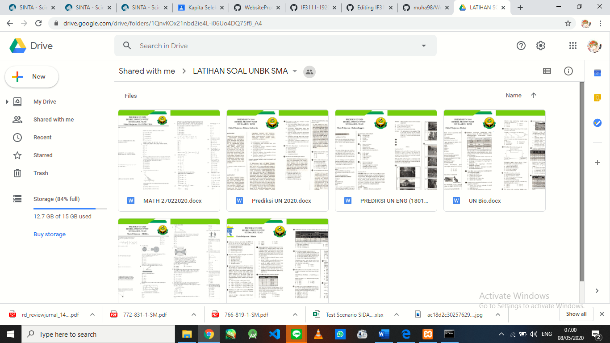

Berikut adalah google drive yang ditampilkan ketika pengguna memilih link yang ada pada halaman materi.

#### 4. Halaman Video

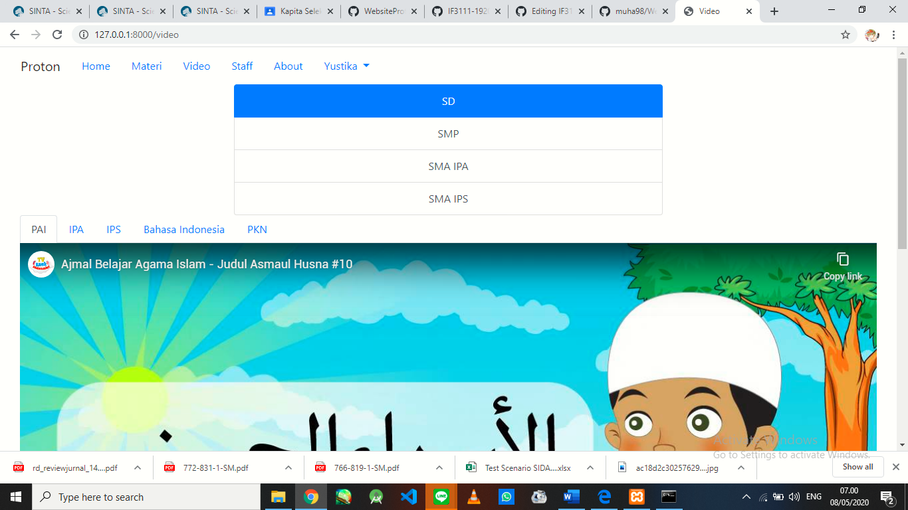

Sama seperti halaman materi, halaman video hanya dapat diakses ketika pengguna telah melakukan login. Halaman video berisikan video pembelajaran yang dibedakan berdasarkan kategori dan mata pelajaran. Video dapat dijalankan secara langsung dari website selama pengguna terhubung dengan internet.

#### 5. Halaman Staff

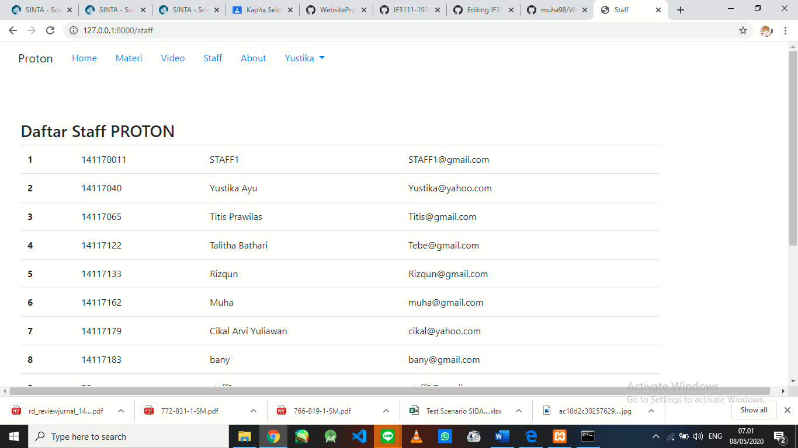

Halaman staff adalah halaman yang memuat data-data staff yang ada di Bimbel Proton.

#### 6. Halaman About

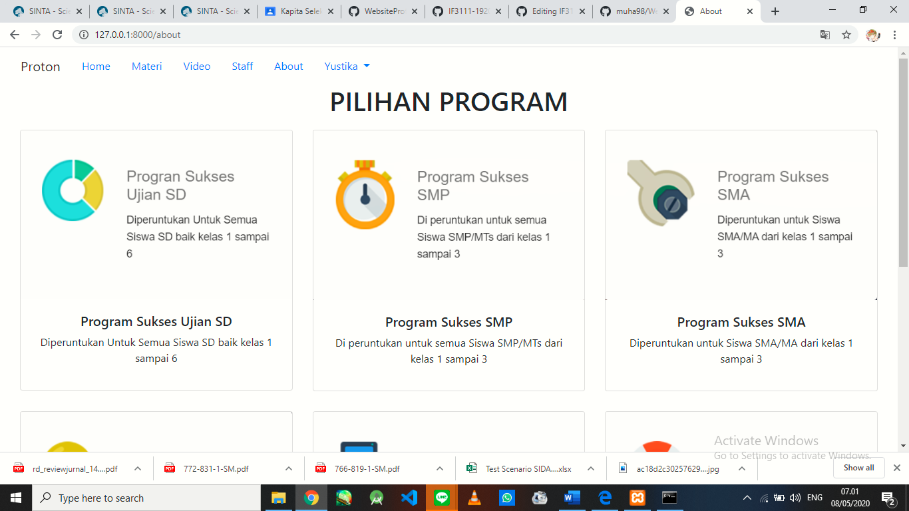

Halaman about berisikan deskripsi singkat mengenai program-program yang ada di bimbel Proton. Halaman ini dapat dibuka tanpa melakukan login. Harapannya agar orang-orang mengetahui program-program yang ada di bimbel Proton dan tertarik untuk mendaftar di bimbel Proton.

#### 7. Halaman Utama Admin

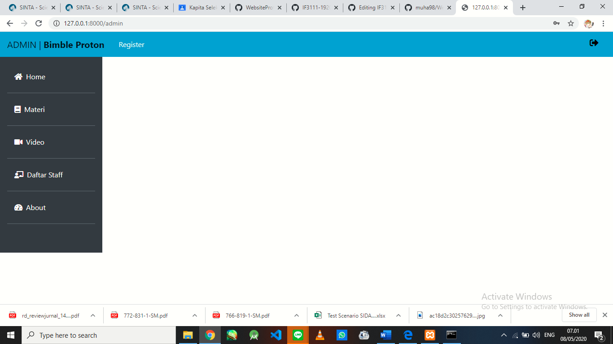

Halaman yang pertama kali ditampilkan apabila pengguna yang login adalah admin, bukan pelajar. Halaman ini tidak dapat diakses oleh pelajar.

#### 8. Halaman Edit Home

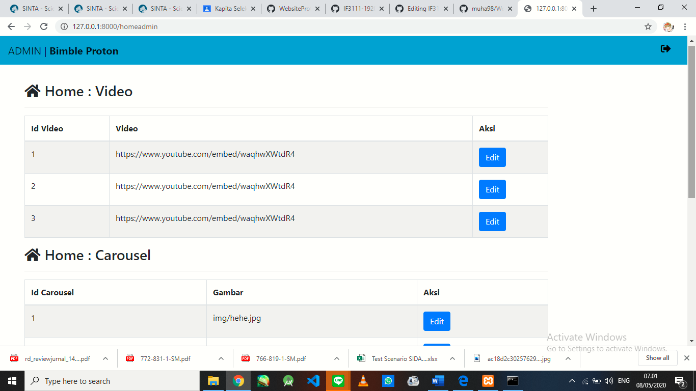

Halaman ini digunakan oleh admin untuk melakukan perubahan yang ada pada halmaan home website, seperti video, gambar, dan artikel.

#### 9. HAlaman Edit Materi

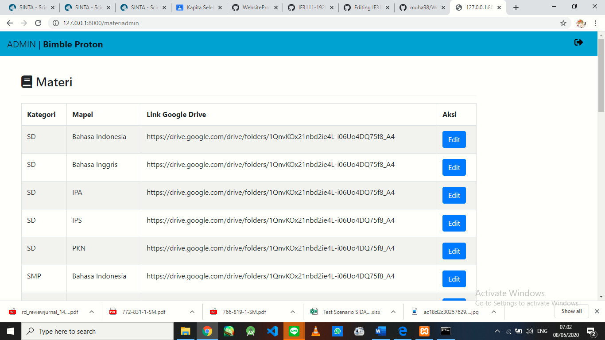

Halaman ini dgunakan oleh admin untuk melakukan perubahan link google drive yang ada pada halaman materi.

#### 10. Halaman Edit Video

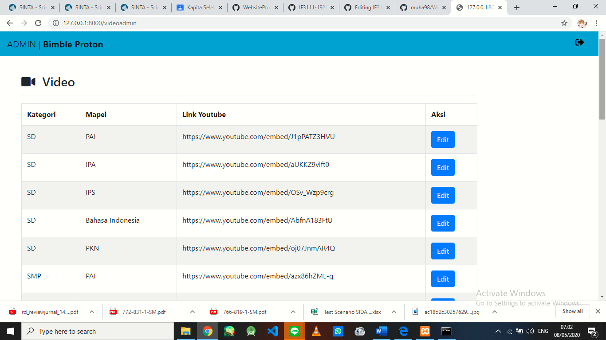

Halaman ini digunakan oleh admin untuk melakukan perubahan link video yang ada pada halaman video.

#### 11. Halaman Edit Staff

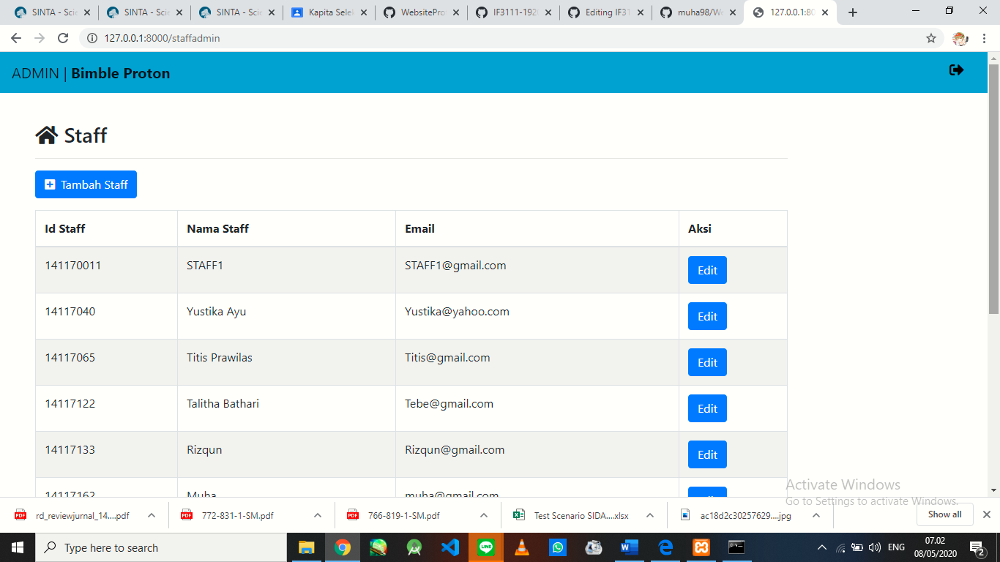

Halaman ini digunakan oleh admin untuk melakukan perubahan data staff yang ada pada halaman staff. Selain mengedit data, admin juga dapat menambahkan data staff baru dari sini.

#### 12. Register

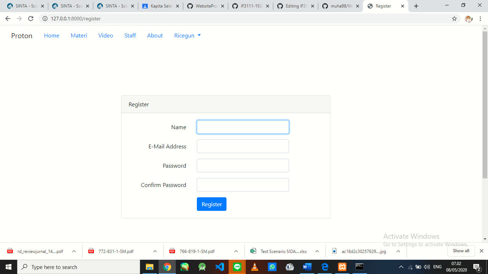

Apabila pengguna adalah admin, maka admin/pengguna tersebut dapat melakukan register untuk membuat akun baru. Hal ini dilakukan apabila terdapat Siswa baru yang mendaftar ke Bimbel Proton.

#### 13. Login

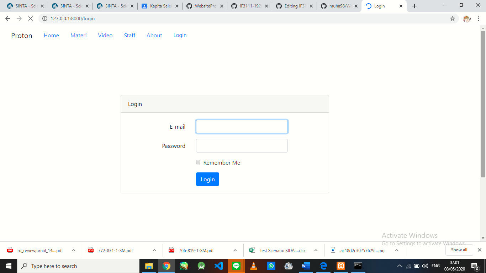

Berikut adalah tampilan untuk bagian login. Login dilakukan dengan memasukkan email dan password. Apabila pengguna yang login adalah pengguna biasa, maka akan diarahkan ke bagian home. Namun apabila pengguna adalah admin, maka akan diarahkan ke halaman utama admin.
